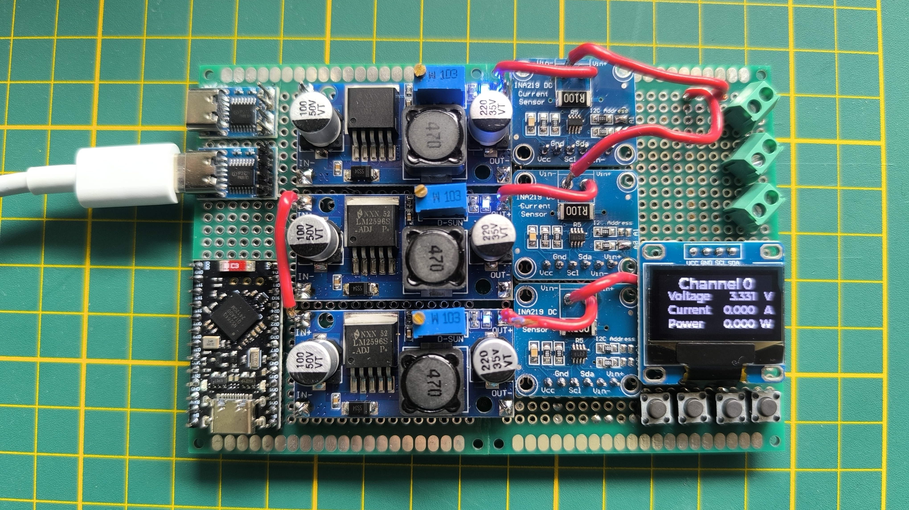

# USB PD PSU
Simple USB Power Delivery PSU with voltage, current and power measurements.



## Hardware design
The device features:
- nRF52840 MCU in a [ProMicro (nice!nano) nRF52840 board](https://nicekeyboards.com/docs/nice-nano/) 
- 3x a LM2596S DC/DC step down converter
- USB-PD IP2721 chip with USB-C socket
- SSD1306 OLED screen
- 4x buttons (3x user and reset)
- 3x INA219 power measurement units

The PSU negotiates with a USB-C charger for a voltage up to 20V. 
Two voltages can be set with the onboard potetiometers.
The third supplies the MCU, OLED display and cannot be changed!

All communication happens via I2C. Measurement chips are configured for addresses: `0x40, 0x41 and 0x44`. The display is under address `0x3C`.

All modules can be easily found on various on-line shopping sites.

## Firmware
Written under [ZephyrOS](https://docs.zephyrproject.org/latest/index.html). Can be fairly easily ported to any other ARM-CortexM based MCU, thanks to Zephyr's device tree magic.

The GUI is written using `lvgl` library from inside Zephyr's repository.

The measurements are done via Zephyr's `sensor` API.

### Compile and run
Inside a zephyr environment:
```
west build -b promicro_nrf52840/nrf52840/uf2
west flash
```

## OpenThread
For now, for the device to join a network you must:

1. Go to your OTBR or any router with commissioner functionality
    ```bash
    $ sudo ot-ctl
    commissioner start
    commissioner joiner add * 998877
    ```
2. Go to the USB PD PSU device's shell
    ```bash
    usb-pd-psu> ot thread stop
    usb-pd-psu> ot joiner start 998877

    # after joining finished

    usb-pd-psu> kernell reboot
    ```

## Tasks
- [ ] GUI screen for OT joiner
- [ ] CoAP support for remote measurement readout
- [x] OpenThread connectivity and shell
- [x] Button support to switch screens
- [x] Create basic LVGL GUI
- [x] SSD1306 support
- [x] Read measurements of each channel

## Copyright
2025 G2Labs Grzegorz Grzęda under MIT license